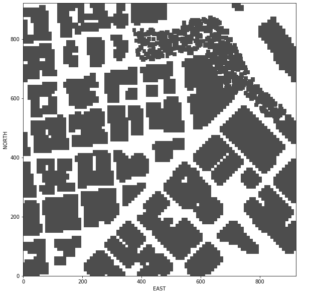

# FCND - 3D Motion Planning

### 1. Project Overview
Goal of this project is to create a path planner, Which plan and generate safe and smooth trajectories for a simulated drone through an urban environment in a simulator. 

#### 1.1 The 2.5D map of the urban environment is in colliders.csv
The colliders.csv file that we used is a 2.5D grid representation showing downtown San Francisco at roughly one meter resolution. We read the global home location from the first line of the colliders.csv file and set that position as global home (self.set_home_position()).  Starting from the third row is the obstacles data in the map, Position of each obstacle is represented by discrete X,Y,Z coordinates, Size of each obstacle is represented by halfSizeX,halfSizeY,halfSizeZ.



### 2. Project Rubric

#### 2.1. Explain the Starter Code
motion_planning.py is an evolutionary version of backyard_flyer_solution.py for simple path planning. A new feature in motion_planning.py is automated path planning with a path planner, While in  backyard_flyer_solution.py, we create a simple square shaped flight path manually.  

The following are the modifications between motion_planning.py and backyard_flyer_solution.py. 

- Add a new state (PLANNING) in the finite-state machine, between ARMING and TAKEOFF. 
- Add a new method plan_path. When the drone is at the state ARMING and it is actually armed (line 66), the transition to the PLANNING state is executed on the method plan_path.
- The method plan_path define a motion planning pipeline. first, read in the hardcoded global home ([-122.397438, 37.7924766, 0.]) and obstacle map from colliders.csv file (line 130 to 133), second, create a grid representation for the drone's environment with the method create_grid (line 136), which defined in the planning_utils.py file. third, define start (this is just grid center) and a goal point in on the grid (line 139 to 143). fourth, Run the path planner (A* Algorithms) to find a path from start to goal
(line 150). Simply convert the path to waypoints. finally, send the waypoints to the simulator.

#### 2.2 Implementing of the Path Planning Algorithm 

##### 2.2.1 Read and set the global home location

The snipped below (line 128 in motion_planning.py) to do read in and set the global home location from the first line of the colliders.csv.

```python
filename = "colliders.csv"
lon0, lat0 = read_global_home(filename)
self.set_home_position(lon0, lat0, 0)        
```   

Definition of the read_global_home function  (line 162 to 170 in planning_utils.py)

```python
def read_global_home(filename):
    """
    Reads home (lat, lon) from the first line of the `file`.
    """
    with open(filename) as f:
        lat_str, lon_str = f.readline().split(',') 
        lat, lon = float(lat_str.split(' ')[-1]), float(lon_str.split(' ')[-1])    

    return lon, lat
```        

##### 2.2.2 From global position to local position 

The snipped below (line 136 in motion_planning.py), first, retrieve current global position.
then, convert from global position to local position.

```python
# retrieve current global position
local_position_g = [self._longitude, self._latitude, self._altitude]

# convert to current local position using global_to_local()
self._north, self._east, self._down =  global_to_local(local_position_g, self.global_home)
``` 

##### 2.2.3 Set start point to the current local position

The snipped below (line 144 to 154 in motion_planning.py)

```python
# Read in obstacle map
data = np.loadtxt(filename, delimiter=',', dtype='Float64', skiprows=2)        

# Define a grid for a particular altitude and safety margin around obstacles
grid, north_offset, east_offset = create_grid(data, TARGET_ALTITUDE, SAFETY_DISTANCE)        
print("North offset = {0}, east offset = {1}".format(north_offset, east_offset))

start_position_l = self.local_position[:2]
grid_start = (int(np.ceil(-north_offset + start_position_l[0])), int(np.ceil(-east_offset + start_position_l[1])))
``` 

##### 2.2.4 Set goal point to arbitrary location on the grid

The snipped below (line 156 to 160 in motion_planning.py)
```python
# adapt to set goal as latitude / longitude position and convert
print("goal_position_g: {}".format(goal_position_g))
goal_position_l = global_to_local(goal_position_g, self.global_home)
grid_goal = (int(np.ceil(-north_offset + goal_position_l[0])), int(np.ceil(-east_offset + goal_position_l[1])))        
print('Local Start and Goal: ', grid_start, grid_goal)

```

##### 2.2.5 Find a path with A* algorithm

- Add four new action in class Action in planning_utils.py(line 63 to 66)

```python
SOUTH_WEST =(-1,-1, np.sqrt(2))
NORTH_WEST =(1,-1, np.sqrt(2))
SOUTH_EAST =(-1, 1, np.sqrt(2))
NORTH_EAST =(1, 1, np.sqrt(2)) 
```
- Add some check in the valid_actions method in planning_utils.py (line 97 to 104)

```python
    if y - 1 < 0 or x - 1 < 0 or grid[x - 1, y - 1] == 1:
        valid_actions.remove(Action.SOUTH_WEST)
    if y - 1 < 0 or x + 1 > n or grid[x + 1, y - 1] == 1:
        valid_actions.remove(Action.NORTH_WEST)
    if y + 1 > m or x + 1 > n or grid[x + 1, y + 1] == 1:
        valid_actions.remove(Action.NORTH_EAST)
    if y + 1 > m or x - 1 < 0 or grid[x - 1, y + 1] == 1:
        valid_actions.remove(Action.SOUTH_EAST)
```

- Run the A* Algorithms to find a path from start to goal (line 164 in motion_planning.py)

```python
#Compute the lowest cost path with a_star
path, _ = a_star(grid, heuristic, grid_start, grid_goal)
```

##### 2.2.6 Prune path with collinearity

- Using collinearity method to prune path (line 169 in motion_planning.py)

```python
        #prune path to minimize number of waypoints
        pruned_path = prune_path(path)
```


### 3. Executing the flight

Run the following command to run the project:  
python motion_planning.py --goal_lat=37.795040 --goal_lon=-122.397293 --goal_alt=0.

#### 3.1 flight path 1:  
start: (37.79530383, -122.39236696, 0.)
goal: (37.79888362, -122.38779981,0.)


#### 3.2 flight path 2:  
start: (37.80067575, -122.3962475, 0.)
goal: (37.79261344, -122.38836266,0.)


#### 3.3 flight path 3:  
start: (37.7959873, -122.38719901, 0.) 
goal: (37.80067575, -122.3962475,0.)


